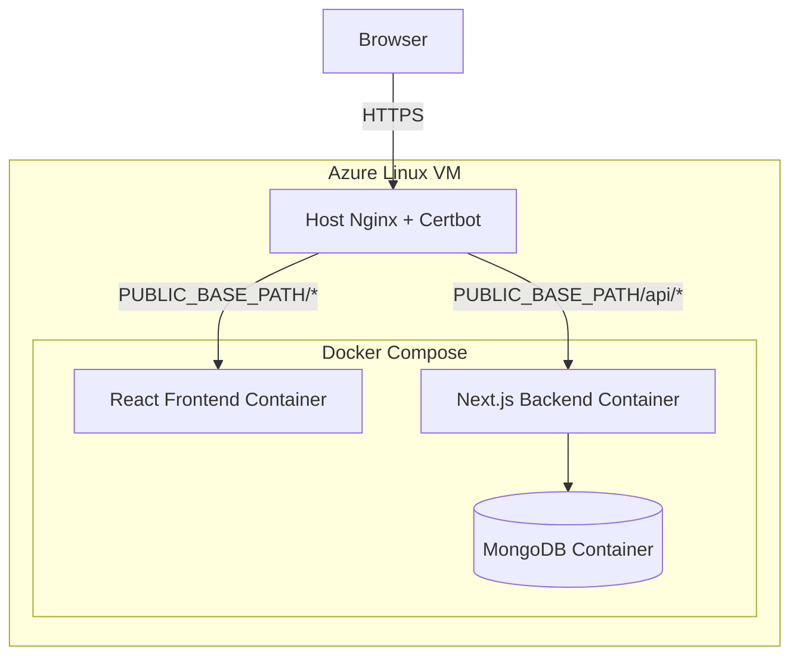
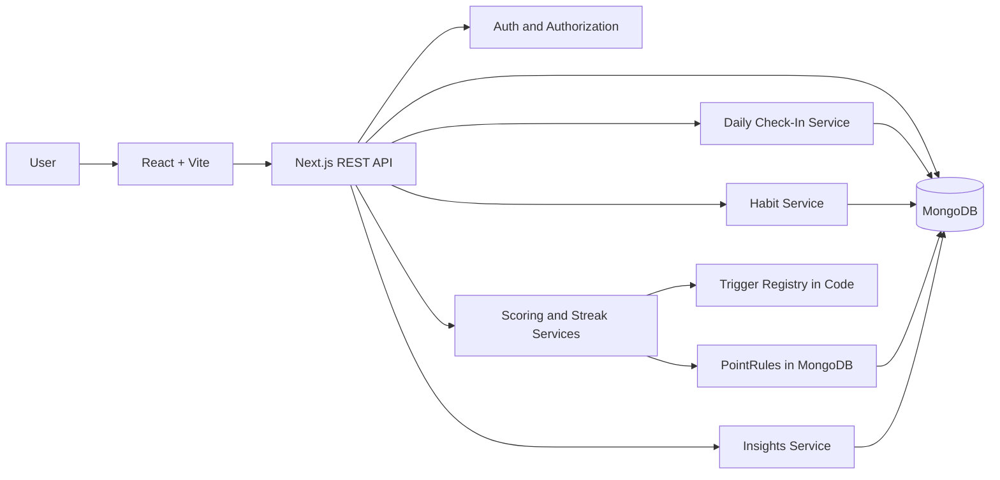

# Wellness Tracker Implementation Guide

## 1. Document Purpose

This document is the authoritative technical implementation guide for the Wellness Tracker. It translates the product requirements into a concrete architecture, data model, API design, frontend structure, backend structure, scoring design, security model, testing approach, and deployment plan.

Implementation developers should follow the architectural decisions in this document unless a concrete implementation problem requires a local adjustment. Minor implementation details may be changed when necessary, but major architectural choices should not be changed without an explicit decision from the project owner.

Examples of decisions that are considered fixed:

- Separate React frontend and Next.js backend applications.
- Separate Git repositories for frontend and backend.
- REST communication between frontend and backend.
- MongoDB as the database.
- TypeScript for both applications.
- Docker Compose for all application services in production.
- Azure Linux VM as the production host.
- Existing host-level Nginx + Certbot/Let's Encrypt as the public HTTPS ingress.
- Configurable public base path so the application can coexist with other services on the same FQDN.
- DailyCheckIn, Habit, User, and PointRule as the main persisted domain models.
- Point trigger definitions implemented in backend code.
- Point values configured through administrator-managed PointRule records.
- Historical point awards stored with DailyCheckIn records.
- Role-based administrator authorization enforced by the backend.

Implementation developers may make small decisions such as component file names, exact helper function names, minor styling details, loading skeleton appearance, or equivalent library configuration details as long as they preserve the behavior and architecture described here.

---

# 2. System Overview

The Wellness Tracker is a responsive web application that lets users record structured daily wellness information, manage custom daily habits, review historical activity, view simple wellness trends, earn points, build streaks, and participate in a leaderboard.

The application consists of two independently developed applications:

1. A React frontend responsible for all user-facing pages and interactions.
2. A Next.js backend responsible for REST endpoints, authentication, authorization, validation, business rules, gamification, analytics, and MongoDB access.

The production system runs on an Azure Linux VM using Docker Compose.

---

# 3. High-Level Architecture



Responsibilities are strictly separated:

```text
React frontend
    |
    | REST requests
    v
Next.js backend
    |
    | Mongoose
    v
MongoDB
```

The React frontend must never connect directly to MongoDB.

The browser must never receive MongoDB credentials, JWT signing secrets, password hashes, or other server secrets.

---

# 4. Repository Layout

The project is developed as two sibling repositories.

```text
wellness-tracker/
├── frontend/     # Separate Git repository
└── backend/      # Separate Git repository
```

The parent directory is only a workspace folder. It does not need to be a Git repository.

Recommended repository names:

```text
wellness-tracker-frontend
wellness-tracker-backend
```

The production Docker Compose configuration should live in the backend repository because the backend owns the application infrastructure and database integration.

The expected production checkout structure on the VM is:

```text
~/<specified path, like ~ apps >/wellness-tracker/
├── .env.production
├── frontend/
└── backend/
    ├── docker-compose.prod.yml
    └── deploy/
        └── nginx/
            ├── wellness-tracker.locations.conf.template
            └── render-snippet.sh
```

The Compose file in the backend repository may use `../frontend` as the frontend build context.

The VM's existing host-level Nginx configuration remains outside the repositories. The repository may provide an include-snippet template and a small rendering helper, but the generated snippet is installed into the host Nginx configuration by the operator.

---

# 5. Technology Stack

## 5.1 Frontend

Required:

- React
- TypeScript
- Vite
- React Router
- TanStack Query
- React Hook Form
- Zod for client-side form validation where useful
- Tailwind CSS for styling
- Radix UI primitives for accessible dialogs, dropdowns, popovers, and similar controls
- Recharts for charts
- react-day-picker for calendar interaction
- date-fns for date formatting and range handling
- Lucide icons

Do not use Redux unless a concrete need appears that cannot reasonably be handled by TanStack Query and local React state.

Server data belongs in TanStack Query. Small UI state belongs in component state or focused context providers.

## 5.2 Backend

Required:

- Next.js
- TypeScript
- Next.js App Router route handlers
- Mongoose
- Zod
- jose for JWT creation and verification
- bcrypt or bcryptjs for password hashing
- date-fns and date-fns-tz for date calculations

Recommended:

- pino or a similarly small structured logger

The backend is an API application. It is not the primary UI application.

## 5.3 Database

- MongoDB
- Mongoose ODM

MongoDB runs as a Docker Compose service in production and uses a persistent named volume.

## 5.4 Production Infrastructure

- Azure Linux VM
- Docker Engine
- Docker Compose
- Existing host-level Nginx
- Existing Certbot / Let's Encrypt TLS setup
- Docker named volume for MongoDB data

The application itself runs in Docker Compose, but the public reverse proxy does not. The VM's existing Nginx remains the single public ingress for this and the other services already hosted on the machine.

Only the host Nginx listens publicly on ports 80 and 443. The frontend and backend containers bind their published ports to `127.0.0.1` only. MongoDB is not published to the host at all.

---

# 6. Development Environment

Development is performed on macOS.

Recommended local setup:

```text
React frontend        localhost:5173
Next.js backend       localhost:3000
MongoDB               localhost:27017
```

During normal development:

- Run the React frontend natively with Vite for fast hot reload.
- Run the Next.js backend natively with the Next development server.
- Run MongoDB in Docker.

A lightweight development Compose file may be provided for MongoDB only.

Example workflow:

```text
Terminal 1: MongoDB container
Terminal 2: backend npm run dev
Terminal 3: frontend npm run dev
```

Production must use the full Docker Compose stack.

---

# 7. TypeScript and Code Quality Rules

Both repositories must use TypeScript with strict type checking enabled.

Required project-wide rules:

- Avoid `any` except for justified library boundary cases.
- Validate all external input at runtime.
- Keep API DTOs separate from raw database documents where necessary.
- Do not place business logic directly inside route handlers when it can be isolated in a service function.
- Do not duplicate authentication or authorization logic across endpoints.
- Prefer small reusable functions over large route files.
- Keep formatting and linting automated.

Each repository should include:

- ESLint configuration.
- Prettier configuration or an equivalent consistent formatter.
- Scripts for linting, type checking, testing, building, and running locally.

Suggested scripts:

```json
{
  "dev": "...",
  "build": "...",
  "start": "...",
  "lint": "...",
  "typecheck": "...",
  "test": "..."
}
```

---

# 8. Backend Project Structure

Recommended structure:

```text
backend/
├── src/
│   ├── app/
│   │   └── api/
│   │       ├── auth/
│   │       ├── users/
│   │       ├── check-ins/
│   │       ├── habits/
│   │       ├── insights/
│   │       ├── leaderboard/
│   │       ├── admin/
│   │       └── health/
│   ├── lib/
│   │   ├── db/
│   │   ├── auth/
│   │   ├── validation/
│   │   ├── dates/
│   │   └── logger/
│   ├── models/
│   ├── services/
│   │   ├── checkInService.ts
│   │   ├── habitService.ts
│   │   ├── scoringService.ts
│   │   ├── streakService.ts
│   │   ├── insightService.ts
│   │   └── leaderboardService.ts
│   ├── scoring/
│   │   ├── triggerRegistry.ts
│   │   └── evaluators/
│   └── types/
├── scripts/
│   ├── seedAdmin.ts
│   └── seedPointRules.ts
├── deploy/
│   └── nginx/
│       ├── wellness-tracker.locations.conf.template
│       └── render-snippet.sh
├── Dockerfile
├── docker-compose.prod.yml
└── next.config.ts
```

This exact folder naming can be adjusted slightly if needed, but the separation of route handlers, models, services, validation, authentication, and scoring logic should remain.

---

# 9. Frontend Project Structure

Recommended structure:

```text
frontend/
├── src/
│   ├── api/
│   │   ├── client.ts
│   │   ├── auth.ts
│   │   ├── checkIns.ts
│   │   ├── habits.ts
│   │   ├── insights.ts
│   │   ├── leaderboard.ts
│   │   └── admin.ts
│   ├── components/
│   │   ├── ui/
│   │   ├── layout/
│   │   └── charts/
│   ├── features/
│   │   ├── auth/
│   │   ├── checkIn/
│   │   ├── habits/
│   │   ├── calendar/
│   │   ├── insights/
│   │   ├── leaderboard/
│   │   ├── profile/
│   │   └── admin/
│   ├── pages/
│   ├── routes/
│   ├── hooks/
│   ├── types/
│   ├── styles/
│   └── main.tsx
├── Dockerfile
├── nginx.conf
└── vite.config.ts
```

Avoid a single giant `components` folder containing unrelated application logic.

Feature-specific components should live with their feature.

Reusable primitives belong in `components/ui`.

---

# 10. Environment and Public Base-Path Configuration

The application must support deployment below an arbitrary URL path on an existing FQDN. It must not assume that it owns `/` on the domain.

The expected deployment path is likely:

```text
/webdev/wellness-tracker
```

which produces a public URL such as:

```text
https://example.com/webdev/wellness-tracker/
```

However, the path must remain configurable without source-code changes.

## 10.1 Base-Path Contract

Use one deployment setting as the source of truth:

```text
PUBLIC_BASE_PATH=/webdev/wellness-tracker
```

Rules:

- `/` is valid for a root deployment.
- A non-root path must start with `/`.
- A non-root path should not end with `/` in configuration.
- Source code must not hard-code `/webdev/wellness-tracker`.
- Source code must not assume that frontend assets or API routes begin at the FQDN root.

The production build receives this value and generates the correct frontend asset and router paths.

## 10.2 Backend Environment Variables

Required production variables:

```text
NODE_ENV=production
MONGODB_URI=...
JWT_SECRET=...
APP_ORIGIN=https://example.com
PUBLIC_BASE_PATH=/webdev/wellness-tracker
JWT_EXPIRES_IN=7d
```

Operational/container settings should also be configurable because the VM hosts other services:

```text
FRONTEND_HOST_PORT=18080
BACKEND_HOST_PORT=13000
LOG_LEVEL=info
```

The exact host ports may be changed to avoid conflicts. They must remain bound to loopback only.

`APP_ORIGIN` contains the origin only, not the base path. `PUBLIC_BASE_PATH` contains the path prefix only.

`JWT_SECRET` must be a strong random secret and must never be committed to Git.

## 10.3 Frontend Build-Time Configuration

Vite's `base` option must be generated from the configured public base path.

Conceptually:

```ts
const configuredPath = process.env.VITE_PUBLIC_BASE_PATH ?? "/";
const viteBase = normalizeToSlashTerminatedBase(configuredPath);

export default defineConfig({
  base: viteBase,
});
```

The Docker frontend build receives:

```text
VITE_PUBLIC_BASE_PATH=${PUBLIC_BASE_PATH}
```

as a build argument/environment value before `npm run build`.

Because Vite bakes its base URL into the production bundle, changing `PUBLIC_BASE_PATH` requires rebuilding the frontend image. This is intentional.

## 10.4 Frontend Route and API Helpers

Frontend code must derive routing and API prefixes from Vite's compiled base URL rather than hard-coding absolute root paths.

A small configuration module should normalize `import.meta.env.BASE_URL` once and export values similar to:

```ts
// BASE_URL is "/" locally or "/webdev/wellness-tracker/" in production.
const viteBase = import.meta.env.BASE_URL;

export const appBasePath =
  viteBase === "/" ? "" : viteBase.replace(/\/$/, "");

export const apiBaseUrl = `${appBasePath}/api`;
```

React Router must use the same base path:

```tsx
<BrowserRouter basename={appBasePath || "/"}>
  ...
</BrowserRouter>
```

API calls then use `apiBaseUrl`, for example:

```text
/api/check-ins                         # local development
/webdev/wellness-tracker/api/check-ins # production example
```

Do not maintain a second manually configured production API prefix unless a concrete future requirement makes it necessary. The API prefix should be derived from the same base-path source so frontend routes and API routes cannot silently drift apart.

## 10.5 Static Asset Rules

To avoid broken assets when hosted below a subpath:

- Prefer importing images, SVGs, fonts, and other assets through Vite/TypeScript imports.
- Do not hard-code asset URLs such as `/assets/...`.
- Do not hard-code `/favicon.ico` or other public-directory resources.
- Public-directory resources must use Vite's base-aware URL mechanism, such as `%BASE_URL%` in `index.html` or `import.meta.env.BASE_URL` in application code.
- React Router navigation must use router links rather than building root-relative URLs manually.
- Any explicit browser redirect or generated application link must pass through a shared base-path helper.

These rules are mandatory because the production application is expected to coexist below paths already used by other services.

## 10.6 Local Development Proxy

Local development should keep the browser on one logical origin from the frontend's perspective.

Vite should proxy `/api` to the local Next.js backend:

```text
Browser -> http://localhost:5173/api/*
                 |
                 v
          http://localhost:3000/api/*
```

This means frontend code can use the same relative API strategy locally and in production, and normal development does not require broad CORS configuration.

## 10.7 Backend Base-Path Behavior

The Next.js backend should continue to define its internal API routes at normal paths such as:

```text
/api/auth/login
/api/check-ins
/api/habits
```

Do **not** configure Next.js `basePath` for this API-only backend. The host Nginx layer strips the public application prefix before proxying requests to Next.js.

The backend still receives `PUBLIC_BASE_PATH` because it needs the public path for concerns such as authentication cookie scoping.

## 10.8 Environment Validation

The backend should validate required environment variables at startup and fail immediately with a useful error if critical configuration is missing.

`PUBLIC_BASE_PATH` should also be normalized and validated at startup so malformed values do not produce invalid cookie paths or public URLs.

---

# 11. Authentication Design

Authentication uses an HTTP-only JWT cookie.

The cookie should contain a signed JWT with at least:

```text
sub       user id
role      user or admin
iat       issued-at timestamp
exp       expiration timestamp
```

Recommended behavior:

- Passwords are hashed before storage.
- JWTs are signed using `JWT_SECRET`.
- Cookie name should be application-specific, for example `wellness_session`, to avoid collisions with other services on the same FQDN.
- Cookie is `HttpOnly`.
- Cookie is `SameSite=Lax`.
- Cookie is `Secure` in production.
- Cookie path is the configured `PUBLIC_BASE_PATH`, or `/` for a root deployment.
- Default session lifetime is approximately seven days.

Logout clears the authentication cookie.

The frontend should determine authentication state through `GET /api/auth/me` rather than decoding the token itself.

---

# 12. Authorization Design

Create centralized backend helpers such as:

```text
requireUser(request)
requireAdmin(request)
```

`requireUser` should:

- Verify the authentication cookie.
- Validate the JWT.
- Resolve the user.
- Reject missing or invalid sessions.

`requireAdmin` should call the same authentication logic and additionally verify that:

```text
user.role === "admin"
```

Authorization must be enforced server-side.

Frontend route guards exist only for user experience and must not be treated as a security boundary.

Every request that reads or mutates user-owned data must use the authenticated user's ID rather than trusting a user ID supplied by the client.

---

# 13. Same-Origin Requests and Request Security

The preferred development and production topology is same-origin from the browser's perspective:

- Development browser requests `/api/*` through the Vite development proxy.
- Production browser requests `PUBLIC_BASE_PATH/api/*` through the host Nginx reverse proxy.

Therefore, normal application operation should not require permissive CORS rules.

If direct cross-origin API access is introduced later, it must be explicitly configured for exact trusted origins only. Do not enable wildcard CORS for authenticated endpoints.

For state-changing authenticated requests, the backend should validate the request `Origin` against `APP_ORIGIN` as a lightweight CSRF defense in addition to `SameSite=Lax` cookies.

The host Nginx proxy must forward the original host and scheme using `X-Forwarded-*` headers so backend security and logging code can reason correctly about the public request.

---

# 14. API Response Format

Use a consistent JSON response structure.

Successful request:

```json
{
  "data": {}
}
```

Successful list request:

```json
{
  "data": []
}
```

Error response:

```json
{
  "error": {
    "code": "VALIDATION_ERROR",
    "message": "The submitted data is invalid.",
    "details": {}
  }
}
```

The `details` field is optional.

Do not expose internal stack traces to the frontend in production.

---

# 15. HTTP Status Code Rules

Use standard status codes consistently:

```text
200 OK                    successful read/update
201 Created               successful create
204 No Content            successful delete when no body is required
400 Bad Request           invalid input
401 Unauthorized          not authenticated
403 Forbidden             authenticated but not allowed
404 Not Found             resource does not exist
409 Conflict              duplicate or conflicting resource
422 Unprocessable Entity  optional for semantic validation failures
500 Internal Server Error unexpected server failure
503 Service Unavailable   dependency unavailable, such as database readiness
```

Do not return HTTP 200 for failed operations.

---

# 16. Date and Time Strategy

Date handling is a critical architectural requirement.

Each user should have an IANA timezone stored on their profile, for example:

```text
Asia/Bangkok
America/New_York
Europe/London
```

The browser should detect the timezone during registration or first profile setup using:

```js
Intl.DateTimeFormat().resolvedOptions().timeZone
```

Daily wellness records should use a local calendar date string:

```text
YYYY-MM-DD
```

Example:

```text
2026-10-07
```

Do not represent the identity of a DailyCheckIn solely through midnight UTC timestamps.

All system timestamps such as `createdAt`, `updatedAt`, and award timestamps should remain UTC timestamps.

Streak calculations are based on `localDate` values in the user's timezone.

---

# 17. MongoDB Models

The primary persisted collections are:

```text
users
dailyCheckIns
habits
pointRules
```

There is no standalone PointEvent collection.

There is no standalone Goal collection.

There is no standalone SobrietyEntry collection.

There is no standalone Meal collection.

---

# 18. User Model

Recommended conceptual schema:

```ts
User {
  _id: ObjectId
  email: string
  passwordHash: string
  displayName: string
  role: "user" | "admin"
  timezone: string

  goals: {
    sleepHours: number
    waterMl: number
    mealsPerDay: number
    targetMood?: number
    targetBowelStatus?: string
  }

  leaderboardEnabled: boolean

  createdAt: Date
  updatedAt: Date
}
```

Notes:

- Email must be normalized to lowercase.
- Email must be unique.
- Password hash is never returned through API DTOs.
- Admin accounts use the same collection.
- Goals are embedded because there is one bounded set of wellness targets per user.
- Total points should not be stored as the canonical score. The leaderboard should derive score totals from stored DailyCheckIn point awards.

Recommended indexes:

```text
unique email
role
leaderboardEnabled
```

---

# 19. DailyCheckIn Model

Recommended conceptual schema:

```ts
DailyCheckIn {
  _id: ObjectId
  userId: ObjectId
  localDate: string

  sleep: {
    durationMinutes: number | null
    quality: "poor" | "fair" | "good" | "great" | null
  }

  waterMl: number | null

  mood: 1 | 2 | 3 | 4 | 5 | null

  meals: {
    breakfast: {
      status: "not_logged" | "eaten" | "skipped"
      description?: string
    }
    lunch: {
      status: "not_logged" | "eaten" | "skipped"
      description?: string
    }
    dinner: {
      status: "not_logged" | "eaten" | "skipped"
      description?: string
    }
    snacks: Array<{
      description: string
    }>
  }

  alcoholStatus:
    | "none"
    | "light"
    | "heavy"
    | "blackout"
    | null

  bowelStatus:
    | "none"
    | "uncomfortable"
    | "normal"
    | "good"
    | null

  habitCompletions: Array<{
    habitId: ObjectId
    habitNameSnapshot: string
    completed: boolean
  }>

  pointAwards: Array<{
    triggerKey: string
    instanceKey: string
    points: number
    awardedAt: Date
  }>

  createdAt: Date
  updatedAt: Date
}
```

The `instanceKey` prevents duplicate awards for triggers that can occur more than once in a day.

Examples:

```text
DAILY_CHECKIN_COMPLETE
WATER_GOAL_REACHED
HABIT_COMPLETE:<habitId>
```

Recommended indexes:

```text
unique compound index: userId + localDate
index: userId + localDate descending
```

The unique compound index is mandatory.

---

# 20. Why Meal Status Uses Eaten and Skipped

The application needs to distinguish between:

```text
The user forgot to log breakfast.
```

and:

```text
The user intentionally skipped breakfast.
```

For this reason, breakfast, lunch, and dinner use:

```text
not_logged
eaten
skipped
```

A description is only required or meaningful when the meal status is `eaten`.

Snacks remain an optional array and do not determine DailyCheckIn completeness.

---

# 21. Daily Check-In Completion Definition

A DailyCheckIn is considered complete when all required built-in categories are explicitly recorded.

Required fields:

- Sleep duration.
- Sleep quality.
- Water intake.
- Mood.
- Breakfast state.
- Lunch state.
- Dinner state.
- Alcohol status.
- Bowel status.

Custom habits do not determine whether the core DailyCheckIn is complete.

A user may create a partial check-in and update it throughout the day.

The completion state should be computed by shared backend logic rather than stored as an independently editable field.

Recommended helper:

```text
getCheckInCompletion(checkIn)
```

Return values:

```text
missing
partial
complete
```

---

# 22. Habit Model

Recommended conceptual schema:

```ts
Habit {
  _id: ObjectId
  userId: ObjectId
  name: string
  description?: string
  active: boolean
  deletedAt: Date | null
  createdAt: Date
  updatedAt: Date
}
```

All habits are daily.

No recurrence engine is required.

Recommended limits:

```text
Name: 1 to 80 characters
Description: 0 to 200 characters
Maximum active habits per user: 10
```

The active-habit limit prevents accidental UI overload and reduces leaderboard gaming through excessive habit creation.

Habit deletion should be implemented as a soft delete or archive operation by setting `deletedAt` and disabling the habit.

Historical DailyCheckIn records preserve `habitNameSnapshot` so old data remains understandable after a habit is renamed or deleted.

Recommended indexes:

```text
userId + deletedAt
userId + active
```

---

# 23. PointRule Model

Recommended conceptual schema:

```ts
PointRule {
  _id: ObjectId
  triggerKey: string
  points: number
  enabled: boolean
  createdAt: Date
  updatedAt: Date
}
```

Rules:

- `triggerKey` must be unique.
- `triggerKey` must exist in the backend trigger registry.
- `points` must be an integer.
- Recommended allowed range is 0 to 100.
- Only administrators may create, edit, enable, disable, or delete PointRule records.

Recommended index:

```text
unique triggerKey
```

---

# 24. Point Trigger Registry

Supported trigger definitions live in backend source code.

Recommended structure:

```ts
type TriggerDefinition = {
  key: string;
  label: string;
  description: string;
  evaluate: (context: TriggerContext) => boolean | Promise<boolean>;
};
```

Example registry shape:

```ts
const triggerRegistry = {
  DAILY_CHECKIN_COMPLETE: {
    label: "Complete daily check-in",
    description: "All required daily fields are explicitly recorded.",
    evaluate: evaluateDailyCheckInComplete,
  },

  WATER_GOAL_REACHED: {
    label: "Reach water goal",
    description: "Daily water intake reaches or exceeds the user's target.",
    evaluate: evaluateWaterGoalReached,
  },
};
```

The registry must not be stored in MongoDB.

MongoDB configures point values for supported behavior. It does not define executable application behavior.

---

# 25. Initial Supported Point Triggers

The initial implementation should support the following trigger keys:

```text
DAILY_CHECKIN_COMPLETE
HABIT_COMPLETE
ALL_DAILY_HABITS_COMPLETE
WATER_GOAL_REACHED
SLEEP_GOAL_REACHED
ALCOHOL_STATUS_LOGGED
CHECKIN_STREAK_7
CHECKIN_STREAK_30
```

Interpretation:

### DAILY_CHECKIN_COMPLETE
True when the required built-in DailyCheckIn fields are complete.

### HABIT_COMPLETE
True for each active habit that is marked completed for the date.

This trigger is per habit and therefore uses an instance key such as:

```text
HABIT_COMPLETE:<habitId>
```

### ALL_DAILY_HABITS_COMPLETE
True when the user has at least one active habit and all active habits relevant to that date are completed.

If the user has zero active habits, this trigger is false.

### WATER_GOAL_REACHED
True when `waterMl >= user.goals.waterMl`.

### SLEEP_GOAL_REACHED
True when recorded sleep duration meets or exceeds the user's sleep target.

### ALCOHOL_STATUS_LOGGED
True when alcohol status is explicitly recorded, regardless of which allowed state is chosen.

This rewards tracking rather than rewarding a specific alcohol outcome.

### CHECKIN_STREAK_7
True when the completed check-in creates a seven-day consecutive completed check-in streak.

### CHECKIN_STREAK_30
True when the completed check-in creates a thirty-day consecutive completed check-in streak.

Additional trigger types require an explicit product decision and corresponding backend evaluator implementation.

---

# 26. Default Point Rule Seed Values

The backend should include an idempotent seed script that creates missing PointRule records without overwriting administrator changes.

Recommended initial values:

```text
DAILY_CHECKIN_COMPLETE       10
HABIT_COMPLETE                3
ALL_DAILY_HABITS_COMPLETE     5
WATER_GOAL_REACHED            3
SLEEP_GOAL_REACHED            3
ALCOHOL_STATUS_LOGGED          2
CHECKIN_STREAK_7              20
CHECKIN_STREAK_30             50
```

These are configuration defaults, not hard-coded runtime awards.

The runtime award value always comes from the current PointRule record.

---

# 27. Point Award Storage

Point awards are stored inside the relevant DailyCheckIn.

Example:

```json
{
  "triggerKey": "WATER_GOAL_REACHED",
  "instanceKey": "WATER_GOAL_REACHED",
  "points": 3,
  "awardedAt": "2026-10-07T12:00:00.000Z"
}
```

Example habit award:

```json
{
  "triggerKey": "HABIT_COMPLETE",
  "instanceKey": "HABIT_COMPLETE:68abc123...",
  "points": 3,
  "awardedAt": "2026-10-07T12:03:00.000Z"
}
```

The stored point amount is a historical snapshot.

Changing a PointRule later does not alter old stored awards that remain valid.

---

# 28. Point Reconciliation Rules

Point processing must be idempotent.

Saving the same check-in repeatedly must not repeatedly award the same points.

Implement a scoring reconciliation service that:

1. Loads the user's relevant DailyCheckIn records.
2. Evaluates supported triggers.
3. Determines which award instance keys should currently exist.
4. Preserves existing awards whose conditions remain true.
5. Removes awards whose conditions are no longer true after a user edit.
6. Creates newly earned awards using the PointRule value that is active at the time of the new award.
7. Never rewrites the point value of an existing valid historical award just because an administrator changed the PointRule later.

This behavior prevents duplicate awards and prevents simple gaming such as temporarily entering a false value, receiving points, and immediately removing the qualifying data.

Because historical edits can affect streaks, changes to previous dates should trigger streak recalculation for the affected user's check-in history.

The dataset is small enough that correctness is more important than micro-optimization.

---

# 29. Leaderboard Score Calculation

Do not treat a mutable `User.totalPoints` field as the canonical source of truth.

A user's score is the sum of all valid stored point awards in their DailyCheckIn records.

Conceptually:

```text
score = sum(all DailyCheckIn.pointAwards.points for user)
```

The leaderboard service may use a MongoDB aggregation pipeline to calculate totals efficiently.

Only users where:

```text
role == "user"
leaderboardEnabled == true
```

should appear.

This design avoids cross-document score consistency problems.

If performance ever becomes an issue, a cached total may be introduced later, but it must remain derived from point awards.

---

# 30. Streak Calculation

A completed check-in contributes to the main check-in streak.

The primary streak is based on consecutive `localDate` values where the check-in completion state is `complete`.

Recommended service:

```text
calculateCurrentCheckInStreak(userId, asOfDate)
```

Historical edits must be reflected in streak calculations.

Habit streaks may be computed similarly by checking the selected habit's completion state across consecutive dates.

Habit streak display is secondary. The main check-in streak is required.

---

# 31. CRUD and Domain Operations

## 31.1 User

Supported operations:

- Register a user.
- Read the authenticated user's profile.
- Update profile fields.
- Update wellness targets.
- Update leaderboard participation preference.

User account deletion may be implemented if desired, but it is not required for the initial release.

## 31.2 DailyCheckIn

Supported operations:

- Create a check-in for a date.
- Read a check-in by date.
- Read check-ins for a date range.
- Update a check-in.
- Delete a check-in.

## 31.3 Habit

Supported operations:

- Create a habit.
- Read habits.
- Read a specific habit.
- Update a habit.
- Delete/archive a habit.

## 31.4 PointRule

Administrator-only operations:

- Create a PointRule.
- Read PointRules.
- Update a PointRule.
- Delete a PointRule.
- Enable or disable a PointRule.

---

# 32. REST API Endpoints

The following endpoint structure is authoritative unless a minor naming adjustment is necessary.

## Authentication

```text
POST   /api/auth/register
POST   /api/auth/login
POST   /api/auth/logout
GET    /api/auth/me
```

## Current User

```text
GET    /api/users/me
PATCH  /api/users/me
```

## Daily Check-Ins

```text
GET    /api/check-ins?from=YYYY-MM-DD&to=YYYY-MM-DD
POST   /api/check-ins
GET    /api/check-ins/:localDate
PATCH  /api/check-ins/:localDate
DELETE /api/check-ins/:localDate
```

`localDate` uses `YYYY-MM-DD`.

## Habits

```text
GET    /api/habits
POST   /api/habits
GET    /api/habits/:id
PATCH  /api/habits/:id
DELETE /api/habits/:id
```

## Insights

```text
GET    /api/insights?from=YYYY-MM-DD&to=YYYY-MM-DD
```

## Leaderboard

```text
GET    /api/leaderboard
```

The initial leaderboard is all-time.

A weekly leaderboard may be added later without changing the core data model.

## Administrator Point Configuration

```text
GET    /api/admin/point-triggers
GET    /api/admin/point-rules
POST   /api/admin/point-rules
PATCH  /api/admin/point-rules/:id
DELETE /api/admin/point-rules/:id
```

## Health

```text
GET    /api/health
GET    /api/health/ready
```

`/api/health` confirms the backend process is alive.

`/api/health/ready` confirms the backend can connect to MongoDB.

---

# 33. Authentication Endpoint Behavior

## POST /api/auth/register

Input:

```json
{
  "email": "user@example.com",
  "password": "strong-password",
  "displayName": "Alex",
  "timezone": "Asia/Bangkok"
}
```

Behavior:

- Validate input.
- Normalize email.
- Reject duplicate email with 409.
- Hash password.
- Create user with role `user`.
- Set reasonable default wellness targets.
- Create authentication cookie.
- Return safe user DTO.

## POST /api/auth/login

Input:

```json
{
  "email": "user@example.com",
  "password": "strong-password"
}
```

Behavior:

- Validate credentials.
- Create JWT.
- Set authentication cookie.
- Return safe user DTO.

## POST /api/auth/logout

Behavior:

- Clear authentication cookie.

## GET /api/auth/me

Behavior:

- Return the currently authenticated user DTO.
- Return 401 if not authenticated.

---

# 34. Check-In API Behavior

## POST /api/check-ins

Input should include:

```json
{
  "localDate": "2026-10-07",
  "sleep": {},
  "waterMl": 1500,
  "mood": 4,
  "meals": {},
  "alcoholStatus": "none",
  "bowelStatus": "normal",
  "habitCompletions": []
}
```

Behavior:

- Authenticate user.
- Validate date and values.
- Reject duplicate logical check-in for the same date with 409.
- Ignore client-supplied user IDs.
- Create record.
- Run scoring reconciliation.
- Return normalized check-in DTO including completion state and daily points.

## PATCH /api/check-ins/:localDate

Behavior:

- Authenticate user.
- Load only that user's check-in.
- Validate patch fields.
- Update allowed data.
- Reconcile scoring.
- Recalculate affected streak state where necessary.
- Return updated normalized DTO.

## DELETE /api/check-ins/:localDate

Behavior:

- Authenticate user.
- Delete only that user's record.
- Recalculate any streak state affected by the removed date.
- Historical point awards in that check-in disappear because the underlying qualifying activity was deleted.

---

# 35. Habit Completion Synchronization

When a DailyCheckIn is created for a date, the backend should be able to initialize habit completion entries from habits that were active for that user.

Each entry stores:

```text
habitId
habitNameSnapshot
completed
```

If a new habit is created after a DailyCheckIn already exists for today, the current day's check-in should include it the next time the check-in is loaded or edited.

For historical dates, do not automatically inject habits that did not exist at that time unless there is a clear product reason.

A simple implementation may use the habit's creation date and deletion date to decide whether it was relevant on a selected day.

---

# 36. Validation Rules

Backend validation is authoritative.

Recommended constraints:

## User

```text
email                    valid email, normalized lowercase
password                 8 to 128 characters
displayName              1 to 50 characters
timezone                  valid IANA timezone
```

## Goals

```text
sleepHours               0 to 24
waterMl                  0 to 10000
mealsPerDay              0 to 10
targetMood               optional 1 to 5
```

## Daily Check-In

```text
sleep.durationMinutes    0 to 1440
sleep.quality            enum or null
waterMl                  0 to 10000
mood                     1 to 5 or null
alcoholStatus            allowed enum or null
bowelStatus              allowed enum or null
meal description         reasonable length, recommended max 200 characters
snack count              reasonable upper bound, recommended max 10
```

## Habit

```text
name                      1 to 80 characters
description               max 200 characters
max active habits         10
```

## PointRule

```text
triggerKey                must exist in registry
points                    integer 0 to 100
enabled                   boolean
```

---

# 37. Insights and Analytics Service

The backend should provide analytics rather than forcing each frontend page to reimplement statistical logic.

`GET /api/insights` should accept a validated date range.

Recommended maximum initial range:

```text
365 days
```

The response should include enough information for the frontend to render summary cards and charts.

Required metrics:

- Average sleep duration.
- Sleep duration time series.
- Sleep goal completion rate.
- Average water intake.
- Water time series.
- Water goal completion rate.
- Average mood.
- Mood time series.
- Alcohol status distribution.
- Bowel status distribution.
- Daily check-in completion rate.
- Habit completion rate.
- Points earned by date.
- Current check-in streak.

Optional metric:

- A simple descriptive sleep-versus-mood relationship if enough data exists.

Do not present statistical relationships as medical conclusions.

---

# 38. Leaderboard Service

The leaderboard endpoint returns a public-safe projection only.

Recommended response:

```json
{
  "data": [
    {
      "rank": 1,
      "displayName": "Alex",
      "points": 620,
      "currentStreak": 12
    }
  ]
}
```

Never include:

- Email.
- User ID unless required internally by the current user's own UI.
- Sleep data.
- Water data.
- Mood data.
- Meal data.
- Alcohol data.
- Bowel data.
- Habit details.

For equal scores, use a stable tie-breaking strategy such as display name or earliest score attainment. Exact tie display behavior is a minor implementation detail.

---

# 39. Frontend Routes

Required routes:

```text
/login
/register
/today
/calendar
/insights
/leaderboard
/profile
/admin
```

Recommended behavior:

- `/` redirects to `/today` for authenticated standard users.
- `/` redirects to `/admin` for authenticated administrators.
- Unauthenticated users attempting protected routes are redirected to `/login`.
- Normal users attempting `/admin` receive an access-denied state or are redirected to `/today`.

---

# 40. Frontend Authentication State

Use one focused authentication provider or equivalent global mechanism for:

```text
currentUser
isAuthenticated
isAdmin
login()
logout()
refreshCurrentUser()
```

Do not store the JWT in `localStorage`.

The browser receives the JWT only as an HTTP-only cookie.

TanStack Query may be used to fetch `/api/auth/me` and keep the current user synchronized.

---

# 41. Frontend API Client

Create a single API client abstraction.

Responsibilities:

- Use the configured base URL.
- Include credentials.
- Parse the standard response envelope.
- Convert API error responses into a consistent frontend error type.
- Handle 401 responses consistently.

Do not scatter raw `fetch` calls throughout components.

Feature API modules should call the shared client.

---

# 42. TanStack Query Conventions

Use TanStack Query for server state.

Suggested query keys:

```text
["auth", "me"]
["user", "profile"]
["checkIn", localDate]
["checkIns", from, to]
["habits"]
["insights", from, to]
["leaderboard"]
["admin", "pointRules"]
["admin", "pointTriggers"]
```

After mutations, invalidate only relevant queries.

Examples:

Updating today's check-in should typically invalidate:

```text
checkIn today
checkIns current calendar range
insights relevant range
leaderboard
```

Do not globally invalidate every query after every mutation.

---

# 43. Today Page

The Today page is the primary application page.

It should include:

- Current date.
- Daily completion progress.
- Sleep input.
- Water input.
- Mood input.
- Meal inputs.
- Alcohol status input.
- Bowel status input.
- Daily custom habits.
- Today's earned points.
- Current check-in streak.

Interaction requirements:

- Inputs should be quick to operate.
- Saving should provide immediate feedback.
- Prefer local optimistic feedback where safe, but do not allow UI state to permanently diverge from backend state.
- Partial check-ins are allowed.
- The page should work well on mobile.

The page should not become a collection of unrelated large cards. Use visual grouping but keep the experience compact.

---

# 44. Calendar Page

Use `react-day-picker` or an equivalent mature calendar library.

The month view should visually distinguish:

```text
complete
partial
missing
```

Do not rely on color alone. Use shape, icon, label, or another secondary indicator.

Selecting a date opens that date's DailyCheckIn for viewing or editing.

The calendar should request only the visible range plus a small necessary buffer.

---

# 45. Insights Page

Use Recharts for visualization.

Recommended charts:

- Sleep duration line chart.
- Water intake line chart.
- Mood trend line or area chart.
- Alcohol distribution bar or donut chart.
- Habit completion bar chart.
- Points earned over time.

Do not overload the page with charts.

Each chart should include:

- Clear title.
- Date context.
- Human-readable values.
- Empty state.
- Text summary when useful.

Do not create medical-looking risk scores.

---

# 46. Leaderboard Page

The leaderboard should remain simple.

Required information:

```text
rank
display name
total points
optional current streak
```

The authenticated user's row should be visually identifiable.

Do not expose wellness details.

---

# 47. Profile Page

The Profile page should provide:

- Display name.
- Email display.
- Timezone.
- Wellness targets.
- Leaderboard opt-in or opt-out.
- Habit management.
- Logout action.

Recommended target inputs:

```text
Sleep target in hours
Water target in liters or milliliters
Meals per day target
Optional mood target
Optional bowel target
```

The UI may display water in liters while storing milliliters.

---

# 48. Admin Page

The administrator page is intentionally narrow in scope.

Required functionality:

- List current PointRules.
- Show human-readable trigger names from the trigger registry endpoint.
- Add a rule for an unused supported trigger.
- Edit point value.
- Enable or disable a rule.
- Delete a rule.
- Log out.

The create form should use a dropdown populated from `GET /api/admin/point-triggers`.

Do not provide a free-text trigger key field.

Do not allow the administrator to provide executable code or formulas.

The backend must still validate the trigger key even though the UI restricts selection.

---

# 49. UI Design System

The product should look like a consumer wellness application rather than a generic business dashboard.

Use a small internal design system based on:

- CSS variables for semantic colors.
- Consistent spacing scale.
- Consistent border radius scale.
- Consistent typography scale.
- Reusable button, field, card, dialog, badge, segmented control, and progress components.

Recommended visual approach:

- Neutral base surfaces.
- One restrained accent color family.
- High readability.
- Soft borders rather than excessive shadows.
- Compact cards.
- Clear state transitions.
- Limited animation.

Avoid:

- Large decorative gradients.
- Heavy glassmorphism.
- Excessive rounded cards.
- Dashboard-template appearance.
- Unnecessary sidebars.
- Animated decoration with no functional purpose.

---

# 50. Responsive Design

Mobile use is a first-class requirement.

Recommended breakpoints may follow Tailwind defaults, but the implementation should be tested at approximately:

```text
375 px
768 px
1024 px
1440 px
```

Mobile requirements:

- Controls must remain touch-friendly.
- The Today page should avoid horizontal scrolling.
- Calendar interactions must remain usable.
- Charts must resize appropriately.
- Primary actions should not depend on hover.

Desktop may use additional horizontal space but should not become unnecessarily sparse.

---

# 51. Accessibility

Required practices:

- Use semantic HTML.
- Associate labels with form controls.
- Maintain visible focus states.
- Support keyboard interaction.
- Use adequate contrast.
- Do not communicate completion state by color alone.
- Dialogs and dropdowns should use accessible primitives.
- Icon-only buttons need accessible names.
- Charts should have nearby textual summaries where needed.

---

# 52. Loading, Error, and Empty States

Every data-driven page must explicitly support:

```text
loading
success
empty
error
```

Examples:

- No habits: show a clear action to create the first habit.
- No check-in for selected date: show an empty check-in state with a create action.
- No analytics data: explain that more check-ins are needed.
- No PointRules: admin sees a create-rule prompt.

Do not leave blank containers while waiting for network responses.

---

# 53. Error Handling

Backend errors should be logged with enough context for debugging without logging sensitive credentials.

Frontend errors should be translated into clear user-facing messages.

Examples:

```text
"That email is already registered."
"Your session has expired. Please sign in again."
"This date already has a check-in."
"This point trigger is not supported."
"We could not save your changes. Try again."
```

Unexpected backend errors should return a generic public message and log the detailed internal error server-side.

---

# 54. Logging

Use structured backend logs.

Recommended log fields where relevant:

```text
timestamp
level
request path
request method
user id
operation
error code
```

Never log:

- Passwords.
- Password hashes.
- JWT values.
- Database passwords.
- Entire sensitive DailyCheckIn payloads unless specifically required for debugging in local development.

---

# 55. Testing Strategy

Testing should focus on business-critical behavior rather than maximizing coverage numbers.

## 55.1 Backend Unit Tests

Required areas:

- Daily check-in completion logic.
- Trigger evaluators.
- Point reconciliation.
- Streak calculation.
- Validation schemas.
- Authorization helpers where practical.

## 55.2 Backend Integration Tests

Required flows:

- Register and login.
- User cannot access admin routes.
- Admin can manage PointRules.
- Check-in CRUD.
- Habit CRUD.
- Duplicate check-in rejection.
- Duplicate PointRule rejection.
- Ownership enforcement.
- Point awards are not duplicated on repeated saves.
- Editing data can add or remove qualifying awards correctly.

## 55.3 Frontend Tests

Use Vitest and React Testing Library.

Focus on:

- Forms.
- Route guards.
- Today page interaction.
- Habit management.
- Admin PointRule editing.
- Error and empty states.

## 55.4 End-to-End Tests

Use Playwright for a small set of critical flows:

1. Register or log in as a standard user.
2. Create a DailyCheckIn.
3. Create and complete a habit.
4. View calendar history.
5. View leaderboard.
6. Log in as admin.
7. Edit a PointRule.
8. Confirm a later qualifying action uses the changed value.

A small reliable E2E suite is preferred over a large fragile one.

---

# 56. Seed and Bootstrap Scripts

The backend repository should include scripts for initial administrative setup.

## Seed Admin

Provide a script that creates or promotes an administrator account.

Example concept:

```text
npm run seed:admin
```

The script should receive credentials through environment variables or secure command input rather than containing hard-coded production credentials.

## Seed Point Rules

Provide an idempotent script:

```text
npm run seed:point-rules
```

Behavior:

- Create missing default PointRules.
- Do not overwrite existing rules.
- Do not reset administrator customizations.

---

# 57. Docker Strategy

Production uses Docker Compose for the application services.

Compose services:

```text
frontend
backend
mongo
```

The existing VM-level Nginx is deliberately **not** duplicated inside Compose. It already owns ports 80/443, TLS certificates, and routing for other applications on the same FQDN.

All Compose services should use restart policies appropriate for a VM deployment.

Network and port rules:

- `backend` can reach `mongo` over the private Compose network.
- `mongo` has no host port mapping in production.
- `frontend` publishes its HTTP port only to `127.0.0.1` on a configurable host port.
- `backend` publishes port 3000 only to `127.0.0.1` on a configurable host port.
- The host Nginx proxies to those loopback ports.
- No application container binds directly to public `0.0.0.0:80` or `0.0.0.0:443`.

A conceptual port mapping is:

```text
127.0.0.1:18080 -> frontend:80
127.0.0.1:13000 -> backend:3000
mongo            -> Compose network only
```

The host-port numbers are examples and must remain configurable.

---

# 58. Frontend Dockerfile

Use a multi-stage build.

Conceptual stages:

```text
1. Node build stage
   - install dependencies
   - receive VITE_PUBLIC_BASE_PATH as a build argument
   - run Vite build

2. Nginx runtime stage
   - copy dist output
   - serve static assets
```

The frontend container uses its own small Nginx only as a static-file server inside Docker. It is **not** the public TLS reverse proxy.

Its SPA configuration should be equivalent to:

```nginx
location / {
    try_files $uri $uri/ /index.html;
}
```

The host-level Nginx strips `PUBLIC_BASE_PATH` before forwarding to this container, so the container serves files from `/` internally even though the browser sees the application below a subpath.

The production Vite build must use the configured public base path so generated HTML, JavaScript chunks, CSS, and imported asset URLs point to the correct browser-visible location.

---

# 59. Backend Dockerfile

Use a multi-stage build.

Recommended Next.js configuration:

```ts
output: "standalone"
```

Conceptual stages:

```text
1. Dependencies
2. Build
3. Minimal Node runtime
```

The production container should run the standalone Next.js server.

Do not run the development server in production.

The backend does not need Next.js `basePath`; external path-prefix handling is performed by the host Nginx.

---

# 60. MongoDB Container

MongoDB must use a persistent named volume.

Conceptual Compose configuration:

```text
mongo:
  image: mongo:<pinned-major-version>
  restart: unless-stopped
  volumes:
    - mongo_data:/data/db
```

Use MongoDB authentication in production.

The backend connects through the Docker service hostname:

```text
mongo
```

MongoDB port 27017 must not be bound to the host interface in production.

---

# 61. Host-Level Nginx Reverse Proxy and Path Prefix

The VM's existing Nginx is the public entry point for the application. Certbot/Let's Encrypt already manages HTTPS for the FQDN and should continue to do so.

Do not add Caddy or another TLS reverse proxy for this application.

The Wellness Tracker should be mounted inside the existing HTTPS `server { ... }` block through an include snippet.

For an example configuration:

```text
PUBLIC_BASE_PATH=/webdev/wellness-tracker
FRONTEND_HOST_PORT=18080
BACKEND_HOST_PORT=13000
```

a conceptual host Nginx snippet is:

```nginx
# Redirect the no-trailing-slash form to the canonical application root.
location = /webdev/wellness-tracker {
    return 301 /webdev/wellness-tracker/;
}

# Public API path -> Next.js internal /api path.
location ^~ /webdev/wellness-tracker/api/ {
    proxy_pass http://127.0.0.1:13000/api/;
    proxy_http_version 1.1;

    proxy_set_header Host $host;
    proxy_set_header X-Real-IP $remote_addr;
    proxy_set_header X-Forwarded-For $proxy_add_x_forwarded_for;
    proxy_set_header X-Forwarded-Proto $scheme;
}

# All other application paths -> React static server.
# The trailing slash on proxy_pass intentionally strips the public base path.
location ^~ /webdev/wellness-tracker/ {
    proxy_pass http://127.0.0.1:18080/;
    proxy_http_version 1.1;

    proxy_set_header Host $host;
    proxy_set_header X-Real-IP $remote_addr;
    proxy_set_header X-Forwarded-For $proxy_add_x_forwarded_for;
    proxy_set_header X-Forwarded-Proto $scheme;
}
```

The existing Certbot-managed TLS directives remain in the host server block and are not duplicated in the application snippet.

A typical host configuration therefore contains something conceptually like:

```nginx
server {
    server_name example.com;

    # Existing locations for other services...

    include /etc/nginx/snippets/wellness-tracker.conf;

    # Existing Certbot-managed TLS configuration...
}
```

The exact FQDN is not part of the application source configuration.

## 61.1 Nginx Snippet Template

The backend repository should include an example/template rather than a hard-coded production snippet:

```text
deploy/nginx/wellness-tracker.locations.conf.template
```

The template should parameterize at least:

```text
PUBLIC_BASE_PATH
FRONTEND_HOST_PORT
BACKEND_HOST_PORT
```

A small script may render it from `/opt/wellness-tracker/.env.production` using `envsubst` or equivalent. If `envsubst` is used, restrict substitution to those explicit variables so Nginx variables such as `$host` and `$remote_addr` are not accidentally replaced.

After rendering or editing the snippet:

```text
sudo nginx -t
sudo systemctl reload nginx
```

must be run before considering the routing change complete.

## 61.2 Base-Path Routing Contract

For any configured non-root base path `P`, routing must behave as follows:

```text
Public request             Upstream request
P/                         frontend /
P/calendar                 frontend /calendar
P/assets/app.js            frontend /assets/app.js
P/api/auth/me              backend /api/auth/me
P/api/check-ins            backend /api/check-ins
```

This path-stripping contract is intentional. It lets the internal containers remain unaware of the host's crowded URL namespace while the browser receives base-aware frontend assets and routes.

The public path configured for the frontend build, backend cookie scope, and host Nginx snippet must match.

---

# 62. Production Docker Compose

Conceptual topology:

```yaml
services:
  frontend:
    build:
      context: ../frontend
      args:
        VITE_PUBLIC_BASE_PATH: ${PUBLIC_BASE_PATH:-/}
    ports:
      - "127.0.0.1:${FRONTEND_HOST_PORT:-18080}:80"

  backend:
    build:
      context: .
    environment:
      PUBLIC_BASE_PATH: ${PUBLIC_BASE_PATH:-/}
      APP_ORIGIN: ${APP_ORIGIN}
      MONGODB_URI: ${MONGODB_URI}
      JWT_SECRET: ${JWT_SECRET}
    ports:
      - "127.0.0.1:${BACKEND_HOST_PORT:-13000}:3000"

  mongo:
    # MongoDB database, private Compose network only

volumes:
  mongo_data:
```

This is a topology example, not a literal final Compose file. The implementation should additionally include health checks, restart policies, MongoDB authentication, and production-safe secret handling.

The production Compose file must:

- Build frontend and backend images from the checked-out repositories.
- Pass the configured public base path into the frontend build.
- Pass the same base path to the backend runtime.
- Start all required application services.
- Use a named volume for MongoDB persistence.
- Bind frontend/backend host ports to `127.0.0.1` only.
- Keep secrets in environment configuration, not Git.
- Include health checks where practical.

The Compose stack does not own ports 80 or 443 and does not manage TLS certificates.

---

# 63. Health Checks

Backend:

```text
GET /api/health
```

Returns 200 if the process is alive.

Readiness:

```text
GET /api/health/ready
```

Returns 200 only when MongoDB is reachable.

Docker health checks should use these endpoints where practical.

MongoDB should also use an appropriate container health check.

---

# 64. Azure VM Deployment

The target VM already hosts other services behind a host-level Nginx installation with Certbot/Let's Encrypt. Deployment must integrate with that existing ingress instead of replacing it.

Recommended deployment procedure:

1. Confirm Docker Engine and the Docker Compose plugin are installed.
2. Create `/opt/wellness-tracker`.
3. Clone the frontend and backend repositories into sibling directories.
4. Create `/opt/wellness-tracker/.env.production`.
5. Set `PUBLIC_BASE_PATH`, expected to be something such as `/webdev/wellness-tracker`.
6. Choose unused loopback host ports for the frontend and backend containers.
7. Build and start the Compose stack.
8. Render or manually prepare the host Nginx location snippet using the same base path and ports.
9. Include that snippet inside the existing HTTPS server block for the FQDN.
10. Run `sudo nginx -t`.
11. Reload Nginx only after validation succeeds.
12. Run database/admin seed scripts when required.
13. Verify both the public frontend and public API through the configured subpath.

Example Compose command concept:

```text
docker compose \
  --env-file /opt/wellness-tracker/.env.production \
  -f backend/docker-compose.prod.yml \
  up -d --build
```

The actual command may vary depending on final checkout paths.

A production smoke test must explicitly verify subpath behavior, including:

```text
https://<fqdn>/<base-path>/
https://<fqdn>/<base-path>/calendar
https://<fqdn>/<base-path>/api/health
```

and at least one built asset requested below the same base path.

---

# 65. Production Secrets

Production secrets must not be committed to either repository.

Recommended storage:

```text
/opt/wellness-tracker/.env.production
```

Restrict file permissions appropriately.

Secrets include:

- MongoDB credentials.
- JWT secret.
- Any future external service keys.

Non-secret deployment settings such as `PUBLIC_BASE_PATH` and loopback host ports may live in the same protected environment file for operational convenience, even though they are not themselves secrets.

The `.env.production` file must be excluded from Git.

---

# 66. Database Persistence and Backup

MongoDB data must survive container recreation through a named volume.

At minimum, document a manual backup procedure using `mongodump`.

Before destructive database changes or important deployments, create a backup.

A later implementation may add scheduled backups, but automatic backup infrastructure is not mandatory for the initial version.

---

# 67. Deployment Update Procedure

Recommended deployment flow:

```text
1. SSH into VM.
2. Pull frontend changes.
3. Pull backend changes.
4. Run tests or at minimum production builds before deployment when practical.
5. Build updated containers.
6. Restart through Docker Compose.
7. Check container health.
8. Verify the backend internally at `/api/health/ready`.
9. Verify the public API through `${PUBLIC_BASE_PATH}/api/health/ready`.
10. Smoke-test the application root, a client-side route, login, and the Today page through the configured public base path.
11. Confirm that JavaScript, CSS, icons, and other built assets load from the configured base path without 404 errors.
```

Use:

```text
docker compose logs
```

for diagnosis when deployment fails.

---

# 68. API and Database Security

Required security practices:

- Never trust a client-provided user ID for ownership.
- Derive the acting user from the authenticated session.
- Validate every write payload.
- Enforce role checks for admin endpoints.
- Hash passwords.
- Do not expose password hashes.
- Do not expose MongoDB publicly.
- Do not commit secrets.
- Use HTTPS in production.
- Keep normal browser API traffic same-origin through the Vite development proxy and host Nginx in production.
- If cross-origin access is ever enabled, allow exact trusted origins only.
- Use HttpOnly authentication cookies scoped to the application base path.
- Validate request Origin for state-changing authenticated requests in production.

---

# 69. Data Ownership Rules

Every Habit belongs to exactly one user.

Every DailyCheckIn belongs to exactly one user.

Users must never be able to fetch another user's full profile, Habit documents, or DailyCheckIn documents.

PointRules are global configuration and are readable and writable only through appropriate administrator APIs.

Leaderboard results are the only intentionally shared cross-user data and must use a public-safe projection.

---

# 70. Deletion Semantics

## DailyCheckIn

Hard delete is acceptable because deleting a check-in intentionally removes that day's recorded wellness data and its associated point awards.

## Habit

Use soft delete or archival so historical DailyCheckIn records remain understandable.

The DELETE endpoint may still return success while internally setting:

```text
active = false
deletedAt = current time
```

## PointRule

Hard delete is acceptable.

Deleting a PointRule prevents future awards for that trigger but does not remove historical awards.

## User

Initial release does not require account deletion.

---

# 71. Data Migration Policy

Do not introduce a full migration framework unless schema changes actually require one.

For early development:

- Keep Mongoose schema changes backward-compatible where practical.
- Use small one-time scripts for required data migrations.
- Store such scripts in the backend repository.
- Never silently rewrite production records on application startup.

---

# 72. Performance Expectations

The application should prioritize clarity and correctness over premature optimization.

Still follow basic performance practices:

- Query date ranges instead of all historical check-ins.
- Use MongoDB indexes defined in this document.
- Avoid N+1 database loops where a simple query can solve the problem.
- Use projections for leaderboard and calendar summary data.
- Keep frontend bundles reasonable.
- Lazy-load large page modules if useful.
- Avoid unnecessary refetch loops.

No distributed cache is required.

No message queue is required.

No microservice architecture is required.

---

# 73. Calendar Summary Query

For calendar display, do not return every large field if only status markers are needed.

The backend may support a lightweight projection through the existing range endpoint.

Example query:

```text
GET /api/check-ins?from=2026-10-01&to=2026-10-31&view=summary
```

Example response item:

```json
{
  "localDate": "2026-10-07",
  "completion": "complete",
  "pointsEarned": 23
}
```

Exact query parameter naming is flexible, but the optimization behavior is recommended.

---

# 74. DTO Strategy

Do not return raw Mongoose documents directly from route handlers.

Use explicit DTO conversion functions such as:

```text
toUserDto()
toCheckInDto()
toHabitDto()
toPointRuleDto()
```

DTOs should:

- Remove private fields.
- Convert ObjectIds to strings.
- Add derived fields such as completion status and daily point total.
- Keep API output stable even if internal schema details change.

---

# 75. Admin Bootstrap

The first administrator should be created through a backend script rather than public registration.

Public registration always creates:

```text
role = "user"
```

There must be no registration payload that allows a user to choose `admin`.

Administrator promotion must happen through the controlled seed/bootstrap script or a direct deliberate database administration process.

---

# 76. PointRule Creation Rules

When an admin creates a PointRule:

1. Verify authentication.
2. Verify admin role.
3. Validate trigger key against the registry.
4. Verify no PointRule already exists for that key.
5. Validate point range.
6. Create record.

Duplicate rule attempt should return 409 Conflict.

The admin creation dropdown should show only supported triggers that do not already have a rule.

---

# 77. Admin Rule Updates

When an admin updates points from, for example, 10 to 15:

- Existing stored point awards remain unchanged.
- New awards use 15.
- An existing valid award must not be rewritten merely because the configuration changed.

When a rule is disabled:

- Existing awards remain.
- New qualifying events do not create awards while disabled.

When a rule is deleted:

- Existing awards remain.
- New qualifying events receive no award until a new rule for that trigger is created.

---

# 78. Frontend Form Behavior

Forms should prefer direct controls over generic text boxes where values come from a known set.

Examples:

- Mood: segmented control or button group.
- Sleep quality: segmented control.
- Alcohol status: segmented control.
- Bowel status: segmented control.
- Water: numeric control with quick increments.
- Meal state: eaten or skipped controls plus description when eaten.
- Habits: checkboxes or tappable completion rows.

Use text fields only where free text is genuinely needed, such as habit name or meal description.

---

# 79. Save Strategy for Today Page

The Today page may either:

- Save individual sections as the user edits them, or
- Save through one explicit action.

Preferred behavior is lightweight section-level or debounced save because the page represents an evolving daily record.

However, the implementation must avoid generating confusing race conditions or duplicated point processing.

If autosave is used:

- Debounce text inputs.
- Save discrete selections immediately.
- Show saving and saved state.
- Ensure backend scoring remains idempotent.

If implementation complexity becomes excessive, an explicit Save action is acceptable.

This is one of the areas intentionally left to the implementation developer.

---

# 80. Minor Flexibility Allowed

Implementation developers may decide minor details such as:

- Exact component names.
- Exact Tailwind utility composition.
- Whether small forms use dialogs, drawers, or inline editing.
- Exact chart style.
- Exact loading skeleton design.
- Whether a successful mutation uses a toast or inline confirmation.
- Small helper library choices that do not change architecture.
- Exact internal service function signatures.
- Whether autosave or explicit Save is used on the Today page.

Developers should not independently change:

- Frameworks.
- Repository split.
- Database technology.
- Authentication model.
- Main persisted domain model boundaries.
- Point trigger architecture.
- Admin authorization model.
- Production deployment topology.
- Docker Compose requirement.

---

# 81. Implementation Order

Recommended implementation sequence:

## Phase 1: Foundation

- Create frontend and backend repositories.
- Configure TypeScript, linting, formatting, environment handling.
- Add MongoDB connection.
- Add Docker development database.
- Add base routing and API client.

## Phase 2: Authentication

- User model.
- Registration.
- Login.
- Logout.
- `/api/auth/me`.
- Frontend route protection.
- Admin role support.

## Phase 3: DailyCheckIn CRUD

- DailyCheckIn schema.
- Validation.
- REST endpoints.
- Today page basic form.
- Historical date read/edit/delete.

## Phase 4: Habits

- Habit schema and CRUD.
- Profile habit management.
- Daily habit completion integration.

## Phase 5: Scoring

- Trigger registry.
- PointRule schema.
- Default seed rules.
- Scoring reconciliation.
- Daily point display.
- Streak calculation.

## Phase 6: Admin

- Admin PointRule endpoints.
- Admin page.
- Trigger dropdown.
- Authorization tests.

## Phase 7: Calendar and Insights

- Calendar range queries.
- Completion markers.
- Insights endpoint.
- Charts.

## Phase 8: Leaderboard

- Aggregation query.
- Public-safe response.
- Leaderboard page.

## Phase 9: Production Deployment

- Frontend Dockerfile with base-path build argument.
- Backend Dockerfile.
- MongoDB service.
- Production Compose with loopback-only frontend/backend ports.
- Host Nginx include-snippet template.
- Configurable `PUBLIC_BASE_PATH`.
- Azure VM deployment.
- Integration with the VM's existing Certbot-managed HTTPS server block.
- Subpath asset/router/API smoke tests.

## Phase 10: Final Hardening

- End-to-end tests.
- Empty states.
- Error states.
- Mobile review.
- Accessibility review.
- Security review.
- Deployment smoke test.

---

# 82. Definition of Done

The application is implementation-complete when:

- A new user can register, log in, and log out.
- A standard user can create, view, update, and delete DailyCheckIns.
- DailyCheckIns support sleep, water, mood, meals, alcohol, bowel status, and custom habit completion.
- A user can create, view, edit, and delete/archive daily habits.
- A user can change personal wellness targets.
- Point triggers are evaluated through backend code.
- Point values are stored in PointRule documents.
- Historical point awards are stored with DailyCheckIns.
- Repeated saves do not duplicate points.
- Streaks are calculated correctly from completed DailyCheckIns.
- An admin can create, view, edit, enable, disable, and delete PointRules.
- Normal users cannot access administrator actions.
- Calendar history works.
- Insights display meaningful historical metrics.
- Leaderboard displays only safe public information.
- The frontend is responsive and usable on mobile and desktop.
- Production application services run through Docker Compose on the Azure Linux VM.
- The existing host Nginx + Certbot installation provides HTTPS and proxies the configured application subpath.
- The application can be rebuilt for a different `PUBLIC_BASE_PATH` without source-code edits.
- React Router routes, API calls, JavaScript/CSS chunks, and static assets work correctly below the configured subpath.
- Frontend and backend published ports are bound to loopback only.
- MongoDB data persists across container restarts.
- Secrets are not committed to Git.
- Critical backend and end-to-end tests pass.

---

# 83. Final Architecture Summary



The main implementation principle is straightforward:

```text
React owns presentation and interaction.
Next.js owns all trusted application behavior.
MongoDB owns persistent state.
Docker Compose owns production application service orchestration.
The VM's existing Nginx + Certbot installation owns public HTTPS routing.
The configured `PUBLIC_BASE_PATH` defines where the application is mounted on the shared FQDN.
```

The architecture intentionally stays monolithic at the application level. The project does not require microservices, queues, distributed caches, or other infrastructure that would add complexity without improving the product.
